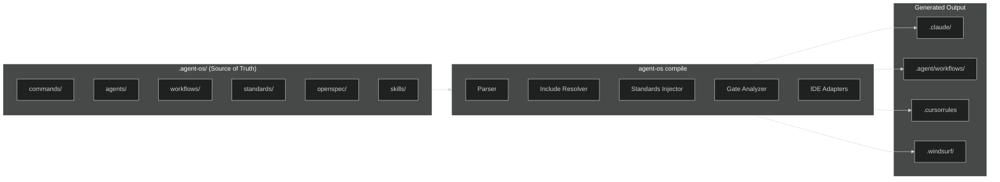

# Agent OS → IDE-Agnostic Migration Plan

> **Objective**: Transform Agent OS from a Claude Code-specific framework into a Universal Agent Operating System that works across all agentic coding IDEs (Antigravity, Cursor, Windsurf, Continue, Aider, etc.).

---

## Part 1: Comprehensive Critique of Current Architecture

### 1.1 What Agent OS Does Well ✅

| Strength                    | Description                                                                                                             |
| --------------------------- | ----------------------------------------------------------------------------------------------------------------------- |
| **Spec-Driven Development** | Clear workflow: Planning → Specification → Implementation → Verification                                                |
| **Profile System**          | Inheritance-based profiles allow customization per project type                                                         |
| **Template Compilation**    | Powerful bash-based compilation with conditionals (`{{IF}}`, `{{UNLESS}}`) and workflow injection (`{{workflows/...}}`) |
| **Separation of Concerns**  | Clean separation: `agents/`, `commands/`, `workflows/`, `standards/`                                                    |
| **Standards Injection**     | Automatic injection of coding standards into prompts                                                                    |
| **Multi-Agent Mode**        | Support for both single-agent and orchestrated multi-agent workflows                                                    |

### 1.2 Critical Limitations ❌

| Issue                            | Problem                                                                 | Impact                                                                    |
| -------------------------------- | ----------------------------------------------------------------------- | ------------------------------------------------------------------------- |
| **Claude Code Lock-In**          | Installation scripts target `.claude/commands/`, `.claude/agents/` only | Cannot be used in Antigravity, Cursor, Windsurf without manual adaptation |
| **Bash-based Compilation**       | Template processing done at install-time via `project-install.sh`       | Runtime changes require reinstallation; no dynamic loading                |
| **Custom Template Syntax**       | Uses `{{workflows/...}}`, `{{standards/*}}`, `{{IF flag}}` syntax       | Non-standard; not understood by any IDE natively                          |
| **No MCP Integration**           | No Model Context Protocol support for skills/tools                      | Cannot leverage IDE skill systems like Antigravity's skillz MCP           |
| **Static Output**                | Commands are "compiled" once into IDE-specific directory                | No runtime adaptation based on context or IDE capabilities                |
| **Missing Interactive Patterns** | No standardized way to define user prompts, confirmation gates          | OpenSpec's gate system not integrated                                     |

### 1.3 Gap Analysis: Agent OS vs OpenSpec (Your Current System)

```mermaid
%%{init: {'theme': 'dark', 'themeVariables': { 'primaryColor': '#6366f1', 'lineColor': '#818cf8'}}}%%
graph TB
    subgraph "Agent OS (Source)"
        A1[✅ Agents with Roles]
        A2[✅ Multi-Phase Commands]
        A3[✅ Workflow Injection]
        A4[✅ Standards System]
        A5[❌ No Change Proposals]
        A6[❌ No Spec Validation]
    end

    subgraph "OpenSpec (Your Current)"
        O1[✅ Change Proposals]
        O2[✅ Spec Validation CLI]
        O3[✅ Three-Stage Workflow]
        O4[✅ Delta Operations]
        O5[❌ No Agents]
        O6[❌ Manual File Loading]
    end

    subgraph "Unified System (Goal)"
        U1[Agents + Proposals]
        U2[Auto Workflow Injection]
        U3[CLI Validation]
        U4[Multi-IDE Output]
        U5[MCP Skills Integration]
        U6[IDE-Agnostic Standard]
    end

    A1 --> U1
    O1 --> U1
    A3 --> U2
    O2 --> U3
    O3 --> U2
    A4 --> U4
    O4 --> U2
```



---

## Part 2: IDE Configuration Landscape Analysis

### 2.1 Current IDE Directory Conventions

| IDE             | Config Directory | Workflow Format                                                            | Skills/Tools                     |
| --------------- | ---------------- | -------------------------------------------------------------------------- | -------------------------------- |
| **Claude Code** | `.claude/`       | Commands in `.claude/commands/`, Agents in `.claude/agents/`               | Skills via YAML frontmatter      |
| **Antigravity** | `.agent/`        | Workflows in `.agent/workflows/` with `---\ndescription:\n---` frontmatter | MCP-based skills (skillz server) |
| **Cursor**      | Project root     | `.cursorrules` file (single file paradigm)                                 | No native skill system           |
| **Windsurf**    | `.windsurf/`     | Rules in `.windsurf/rules/`                                                | Limited                          |
| **Continue**    | `.continue/`     | Custom prompts                                                             | MCP support                      |

### 2.2 The Problem: No Universal Standard

**Current Reality:**

```
my-project/
├── .claude/           # Claude Code only
│   ├── commands/
│   └── agents/
├── .cursorrules       # Cursor only
├── .agent/            # Antigravity only
│   └── workflows/
├── .windsurf/         # Windsurf only
│   └── rules/
└── agent-os/          # Agent OS (requires compilation)
    ├── commands/
    ├── standards/
    └── product/
```

**Each IDE has its own:**

- Directory structure
- Prompt format
- Capability model
- Tool invocation patterns

---

## Part 3: Proposed Solution — Universal Agent Directory Standard (UADS)

### 3.1 Core Design Principles

1. **Single Source of Truth**: Write once, deploy everywhere
2. **Progressive Enhancement**: Works at minimum as static files, enhanced with IDE integration
3. **Runtime Compilation**: Compile to IDE-specific formats on-demand, not install-time
4. **MCP-First Skills**: Leverage Model Context Protocol for cross-IDE tool sharing
5. **OpenSpec Integration**: Embed spec-driven development as a first-class workflow

### 3.2 Proposed Directory Structure

```
my-project/
├── .agent-os/                     # THE Universal Source of Truth
│   ├── config.yml                 # Project configuration
│   ├── agents/                    # Agent personas (roles)
│   │   ├── implementer.md
│   │   ├── spec-writer.md
│   │   └── verifier.md
│   ├── workflows/                 # Agentic workflows (multi-step)
│   │   ├── planning/
│   │   │   ├── create-spec.md
│   │   │   └── gather-requirements.md
│   │   └── implementation/
│   │       ├── implement-tasks.md
│   │       └── verify-implementation.md
│   ├── commands/                  # Entry-point commands (slash commands)
│   │   ├── plan-product.md
│   │   ├── create-spec.md
│   │   └── implement-tasks.md
│   ├── standards/                 # Coding standards (auto-injected)
│   │   ├── backend/
│   │   └── frontend/
│   ├── openspec/                  # Spec-Driven Development
│   │   ├── project.md
│   │   ├── specs/
│   │   └── changes/
│   └── skills/                    # MCP-compatible skills (NEW)
│       ├── git-sync/
│       │   ├── SKILL.md
│       │   └── scripts/
│       └── code-review/
│           ├── SKILL.md
│           └── scripts/
│
├── .claude/                       # [GENERATED] Claude Code adapter output
├── .agent/                        # [GENERATED] Antigravity adapter output
├── .cursorrules                   # [GENERATED] Cursor adapter output
└── .windsurf/                     # [GENERATED] Windsurf adapter output
```

### 3.3 Workflow File Format (Universal)

```markdown
---
# Frontmatter: Metadata for all IDEs
name: plan-product
description: Plan the product mission, roadmap, and tech stack
agent: product-planner # Optional: delegate to agent persona
tags: [planning, product]
requires: # Dependencies
  - standards/backend/*
  - standards/frontend/react
gates: # Approval gates (OpenSpec inspired)
  - after_phase: 2
    require: user_approval
    message: "Review the mission document before proceeding"
---

# Plan Product Workflow

You are helping to plan and document the mission, roadmap and tech stack for the current product.

## Phase 1: Gather Information

[Inline content from workflows/planning/gather-product-info.md]

<!-- @include: workflows/planning/gather-product-info.md -->

## Phase 2: Create Mission Document

<!-- @include: workflows/planning/create-product-mission.md -->

## Phase 3: Create Roadmap

<!-- @include: workflows/planning/create-product-roadmap.md -->

## Standards Compliance

<!-- @inject: standards/* -->
```

### 3.4 Key Syntax Changes from Current Agent OS

| Current Agent OS               | Proposed UADS                    | Reason                                              |
| ------------------------------ | -------------------------------- | --------------------------------------------------- |
| `{{workflows/path}}`           | `<!-- @include: path.md -->`     | Standard HTML comment syntax; parseable by any tool |
| `{{standards/*}}`              | `<!-- @inject: standards/* -->`  | Explicit injection directive                        |
| `{{IF flag}}...{{ENDIF flag}}` | Frontmatter `when:` conditions   | Declarative over imperative                         |
| `{{PHASE N: @agent-os/path}}`  | `## Phase N` + `@include`        | Explicit phase headers                              |
| Install-time compile           | Runtime compile or adapter layer | Dynamic adaptation                                  |

---

## Part 4: Multi-IDE Adapter Architecture

### 4.1 Architecture Overview



### 4.2 Adapter Implementation Strategy

```python
# Pseudocode for adapter architecture

class UniversalWorkflow:
    """Parsed representation of a .agent-os workflow"""
    name: str
    description: str
    phases: List[Phase]
    standards: List[StandardRef]
    gates: List[ApprovalGate]

class IDEAdapter(ABC):
    """Base adapter interface"""

    @abstractmethod
    def compile(self, workflow: UniversalWorkflow) -> str:
        """Compile workflow to IDE-specific format"""
        pass

    @abstractmethod
    def output_path(self, workflow: UniversalWorkflow) -> Path:
        """Return target path for compiled output"""
        pass

class ClaudeCodeAdapter(IDEAdapter):
    def compile(self, workflow):
        # Generate .claude/commands/agent-os/{name}.md
        # With Claude's specific syntax
        pass

class AntigravityAdapter(IDEAdapter):
    def compile(self, workflow):
        # Generate .agent/workflows/{name}.md
        # With ---\ndescription:\n--- frontmatter
        pass

class CursorAdapter(IDEAdapter):
    def compile(self, workflow):
        # Append to .cursorrules as section
        pass
```

### 4.3 CLI Interface

```bash
# Initialize Agent OS in a project
agent-os init

# Compile to all detected/configured IDEs
agent-os compile

# Compile to specific IDE
agent-os compile --target antigravity
agent-os compile --target claude-code
agent-os compile --target cursor

# Watch mode (recompile on change)
agent-os watch

# Validate OpenSpec changes
agent-os openspec validate add-new-feature

# List available commands
agent-os list commands
agent-os list workflows
agent-os list skills
```

---

## Part 5: OpenSpec Integration Strategy

### 5.1 Merge OpenSpec into Agent OS

Your current OpenSpec system has excellent spec-driven development patterns. These should become first-class citizens in Agent OS:

| OpenSpec Component    | Agent OS Integration              |
| --------------------- | --------------------------------- |
| `openspec/project.md` | → `.agent-os/openspec/project.md` |
| `openspec/specs/`     | → `.agent-os/openspec/specs/`     |
| `openspec/changes/`   | → `.agent-os/openspec/changes/`   |
| `openspec validate`   | → `agent-os openspec validate`    |
| `openspec archive`    | → `agent-os openspec archive`     |

### 5.2 Workflow-OpenSpec Integration

```markdown
---
name: create-proposal
description: Start a new OpenSpec capability or update existing specs
agent: spec-writer
openspec: # NEW: OpenSpec integration
  stage: proposal # proposal | implementation | archive
  auto_validate: true # Run validation after workflow
---

# Create Proposal Workflow

## Step 1: Research

Run `agent-os openspec list` and `agent-os openspec list --specs` to understand current context.

## Step 2: Scaffold

Create the proposal structure under `.agent-os/openspec/changes/{change-id}/`

## Step 3: Validate

<!-- @gate: validation -->

Run `agent-os openspec validate {change-id} --strict`
```

---

## Part 6: MCP Skills Architecture

### 6.1 Learning from Antigravity's skillz MCP

Your skillz MCP provides a great model:

- Skills have `SKILL.md` with instructions
- Scripts in `scripts/` folder
- Resources accessible via `resource://skillz/{skill}/{file}`

### 6.2 Agent OS Skills Standard

```
.agent-os/skills/
├── git-sync/
│   ├── SKILL.md              # Skill definition
│   ├── scripts/
│   │   └── git_sync.py       # Executable script
│   └── templates/            # Optional templates
└── code-review/
    ├── SKILL.md
    └── checklists/
        └── security.md
```

**SKILL.md Format:**

````markdown
---
name: git-sync
description: Automates staging, committing, and pushing changes
tools_required:
  - run_command
  - view_file
---

# Git Sync Skill

Automates the git workflow: stage → commit → push

## Usage

Call this skill when the user asks to commit and push changes.

## Instructions

1. Run `git status` to see changes
2. Stage changes with `git add -A`
3. Generate commit message based on changes
4. Commit and push

## Script

```bash
python .agent-os/skills/git-sync/scripts/git_sync.py
```
````

````

### 6.3 Cross-IDE Skill Invocation

| IDE | Skill Invocation Method |
|-----|------------------------|
| **Antigravity** | MCP tool: `mcp_skillz_{skill-name}` |
| **Claude Code** | Skills via YAML frontmatter |
| **Cursor** | Include in .cursorrules or reference directly |
| **All** | Scripts callable via `run_command` |

---

## Part 7: Implementation Phases

### Phase 1: Foundation (Week 1-2)

- [ ] Create `.agent-os/` directory structure
- [ ] Port Agent OS profile/default content to new format
- [ ] Implement parser for new `@include`/`@inject` syntax
- [ ] Create base `UniversalWorkflow` data model

### Phase 2: Adapters (Week 3-4)

- [ ] Implement `AntigravityAdapter` (primary target)
- [ ] Implement `ClaudeCodeAdapter` (maintain backwards compatibility)
- [ ] Implement `CursorAdapter` (single-file output)
- [ ] Build `agent-os compile` CLI command

### Phase 3: OpenSpec Integration (Week 5)

- [ ] Merge OpenSpec directory structure into `.agent-os/openspec/`
- [ ] Implement `agent-os openspec` CLI commands
- [ ] Add `openspec:` frontmatter support to workflows
- [ ] Create proposal/apply/archive workflows

### Phase 4: Skills System (Week 6)

- [ ] Define skill specification (`SKILL.md` format)
- [ ] Create skill loader for each IDE adapter
- [ ] Port key skills (git-sync, code-review)
- [ ] Document skill creation process

### Phase 5: Documentation & Polish (Week 7)

- [ ] Migration guide for existing Agent OS users
- [ ] Migration guide for OpenSpec users
- [ ] IDE-specific setup guides
- [ ] Example project templates

---

## Part 8: Backwards Compatibility

### 8.1 Migration Path for Existing Agent OS Projects

```bash
# Migrate existing Agent OS installation
agent-os migrate

# This will:
# 1. Move agent-os/ content to .agent-os/
# 2. Convert {{}} syntax to @include/@inject
# 3. Generate IDE-specific outputs
# 4. Preserve existing .claude/ structure
````

### 8.2 Coexistence Strategy

During migration, both systems can coexist:

```
my-project/
├── agent-os/          # Legacy (deprecated)
├── .agent-os/         # New universal source
├── .claude/           # Generated by new system
└── .agent/            # Generated by new system
```

---

## Part 9: User Review Required

> [!IMPORTANT]
> The following decisions require your input before implementation:

### Decision 1: Primary IDE Target

Which IDE should be the primary/first-class target for development?

- [ ] Antigravity (current choice based on your request)
- [ ] Claude Code (Agent OS's original target)
- [ ] Both equally

### Decision 2: OpenSpec CLI Dependency

Should the new system:

- [ ] Embed OpenSpec CLI functionality directly (no external dependency)
- [ ] Keep `openspec` CLI as separate tool but integrate it
- [ ] Create `agent-os openspec` as wrapper

### Decision 3: Skill Distribution

How should skills be shared?

- [ ] Embedded in each project's `.agent-os/skills/`
- [ ] Centralized in `~/.agent-os/skills/` (user-global)
- [ ] Both (project can override global)

### Decision 4: Template Syntax

Which include syntax do you prefer?

- [ ] HTML comments: `<!-- @include: path.md -->`
- [ ] Mustache-like: `{{ include "path.md" }}`
- [ ] Custom: Define your preference

### Decision 5: Migration Approach

- [ ] Big-bang: Fully migrate Agent OS in one release
- [ ] Incremental: Add UADS alongside existing system, deprecate gradually

---

## Verification Plan

### Automated Tests

```bash
# Compile and diff test
agent-os compile --target antigravity
diff .agent/workflows/plan-product.md expected/plan-product.md

# OpenSpec integration test
agent-os openspec validate test-change --strict

# Cross-IDE parity test
agent-os compile --all
./tests/verify-parity.sh
```

### Manual Verification

1. **Antigravity**: Run `/plan-product` command and verify workflow executes correctly
2. **Claude Code**: Run `/plan-product` command and compare behavior
3. **Cursor**: Verify `.cursorrules` contains expected context
4. **Skills**: Test `mcp_skillz_git-sync` invocation

---

## Summary

This plan transforms Agent OS from a Claude Code-specific tool into a **Universal Agent Operating System** by:

1. **Creating a canonical source** (`.agent-os/`) that works across all IDEs
2. **Building adapter layer** that compiles to IDE-specific formats
3. **Integrating OpenSpec** for spec-driven development
4. **Adopting MCP Skills pattern** for cross-IDE tool sharing
5. **Providing migration path** for existing users

The result is a system where you write agent instructions once and deploy them to any agentic coding environment.
