# Agent OS → Antigravity Migration Plan (Revised)

> **Objective**: Transform Agent OS from a Claude Code-specific framework into a Universal Agent Directory Standard (UADS) compatible with Antigravity IDE, with architecture designed for future IDE expansion.

---

## Summary of Decisions

| Decision                 | Choice                                  | Rationale                                                     |
| ------------------------ | --------------------------------------- | ------------------------------------------------------------- |
| **Primary IDE Target**   | Antigravity Only                        | Focus on single target; others added later                    |
| **OpenSpec Integration** | None                                    | Agent OS has its own specs system; OpenSpec is reference only |
| **Skill Distribution**   | User-global (`~/.agent-os/skills/`)     | MCP integration available across all projects                 |
| **Template Syntax**      | Mustache-like `{{ include "path.md" }}` | Familiar, readable syntax                                     |
| **Command Prefix**       | `uads-` (lowercase, dash separator)     | Namespace isolation for future frameworks                     |
| **Migration Approach**   | Incremental                             | Add UADS alongside existing system, test, then deprecate      |

---

## Part 1: Critique of Current Architecture (Unchanged)

### 1.1 What Agent OS Does Well ✅

| Strength                    | Description                                                              |
| --------------------------- | ------------------------------------------------------------------------ |
| **Spec-Driven Development** | Clear workflow: Planning → Specification → Implementation → Verification |
| **Profile System**          | Inheritance-based profiles allow customization per project type          |
| **Template Compilation**    | Powerful bash-based compilation with conditionals and workflow injection |
| **Separation of Concerns**  | Clean separation: `agents/`, `commands/`, `workflows/`, `standards/`     |
| **Standards Injection**     | Automatic injection of coding standards into prompts                     |

### 1.2 Critical Limitations ❌

| Issue                      | Problem                                     | Impact                                               |
| -------------------------- | ------------------------------------------- | ---------------------------------------------------- |
| **Claude Code Lock-In**    | Installation scripts target `.claude/` only | Cannot be used in Antigravity without adaptation     |
| **Bash-based Compilation** | Template processing done at install-time    | No dynamic loading; changes require reinstallation   |
| **Custom Template Syntax** | Uses `{{workflows/...}}` syntax             | Non-standard; not understood by Antigravity natively |
| **No MCP Integration**     | No Model Context Protocol support           | Cannot leverage Antigravity's skillz MCP             |

---

## Part 2: Proposed Solution — UADS for Antigravity

### 2.1 Core Design Principles

1. **Single Source of Truth**: `.agent-os/` is the canonical location
2. **Antigravity-First**: Generate `.agent/workflows/` for Antigravity consumption
3. **MCP Skills Integration**: User-global skills accessible across all projects
4. **Mustache-like Syntax**: Familiar template inclusion pattern
5. **Namespaced Commands**: All commands prefixed with `uads-` for isolation

### 2.2 Directory Structure

```
my-project/
├── .agent-os/                     # THE Universal Source of Truth
│   ├── config.yml                 # Project configuration
│   ├── agents/                    # Agent personas (roles)
│   │   ├── implementer.md
│   │   ├── spec-writer.md
│   │   └── verifier.md
│   ├── workflows/                 # Agentic workflows (multi-step)
│   │   ├── planning/
│   │   │   ├── create-spec.md
│   │   │   └── gather-requirements.md
│   │   └── implementation/
│   │       ├── implement-tasks.md
│   │       └── verify-implementation.md
│   ├── commands/                  # Entry-point commands (slash commands)
│   │   ├── uads-plan-product.md
│   │   ├── uads-create-spec.md
│   │   └── uads-implement-tasks.md
│   └── standards/                 # Coding standards (auto-injected)
│       ├── backend/
│       └── frontend/
│
├── .agent/                        # [GENERATED] Antigravity adapter output
│   └── workflows/
│       ├── uads-plan-product.md
│       ├── uads-create-spec.md
│       └── uads-implement-tasks.md
│
└── agent-os/                      # [LEGACY] Existing Agent OS (during migration)
    └── ...
```

### 2.3 User-Global Skills Location

```
~/.agent-os/
├── skills/                        # User-global MCP-compatible skills
│   ├── git-sync/
│   │   ├── SKILL.md
│   │   └── scripts/
│   │       └── git_sync.py
│   └── code-review/
│       ├── SKILL.md
│       └── scripts/
│           └── review.py
└── config.yml                     # Global user preferences
```

> **Note**: These skills integrate with the existing `skillz` MCP server. The MCP server's configuration points to `~/.agent-os/skills/` to make skills available across all projects.

---

## Part 3: Command Naming Convention

### 3.1 Prefix Standard

All UADS commands MUST use the `uads-` prefix:

| Original Agent OS   | UADS Command             |
| ------------------- | ------------------------ |
| `plan-product`      | `uads-plan-product`      |
| `create-spec`       | `uads-create-spec`       |
| `implement-tasks`   | `uads-implement-tasks`   |
| `shape-spec`        | `uads-shape-spec`        |
| `write-spec`        | `uads-write-spec`        |
| `orchestrate-tasks` | `uads-orchestrate-tasks` |

### 3.2 Benefits

- **Namespace Isolation**: Easily distinguish UADS commands from other frameworks
- **Future-Proof**: When other frameworks are added, they can have their own prefixes
- **Discoverability**: Type `uads-` and see all available commands via autocomplete

---

## Part 4: Template Syntax

### 4.1 Mustache-Like Include Syntax

**Include a workflow file:**

```markdown
{{ include "workflows/planning/gather-requirements.md" }}
```

**Include with relative path:**

```markdown
{{ include "./gather-requirements.md" }}
```

**Inject all standards matching a pattern:**

```markdown
{{ inject "standards/*" }}
{{ inject "standards/backend/*" }}
```

**Conditional inclusion:**

```markdown
{{ if use_subagents }}
Delegate to the implementer agent.
{{ endif }}
```

**Reference an agent:**

```markdown
{{ agent "implementer" }}
```

### 4.2 Syntax Comparison

| Current Agent OS               | UADS (Mustache-like)                     |
| ------------------------------ | ---------------------------------------- |
| `{{workflows/path}}`           | `{{ include "workflows/path.md" }}`      |
| `{{standards/*}}`              | `{{ inject "standards/*" }}`             |
| `{{IF flag}}...{{ENDIF flag}}` | `{{ if flag }}...{{ endif }}`            |
| `{{PHASE N: @agent-os/path}}`  | `## Phase N` + `{{ include "path.md" }}` |

---

## Part 5: Antigravity Adapter

### 5.1 Compilation Process

```mermaid
%%{init: {'theme': 'dark'}}%%
flowchart LR
    subgraph Source[".agent-os/ (Source)"]
        S1[commands/uads-*.md]
        S2[workflows/]
        S3[standards/]
        S4[agents/]
    end

    subgraph Compiler["uads compile"]
        C1[Parse Mustache Syntax]
        C2[Resolve Includes]
        C3[Inject Standards]
        C4[Add Frontmatter]
    end

    subgraph Target[".agent/workflows/"]
        T1[uads-plan-product.md]
        T2[uads-create-spec.md]
        T3[uads-implement-tasks.md]
    end

    Source --> Compiler --> Target
```



### 5.2 Antigravity Workflow Format

Compiled output for `.agent/workflows/uads-plan-product.md`:

```markdown
---
description: Plan the product mission, roadmap, and tech stack
---

# Plan Product Workflow

You are helping to plan and document the mission, roadmap and tech stack for the current product.

## Phase 1: Gather Information

[Content from workflows/planning/gather-requirements.md - fully expanded]

## Phase 2: Create Mission Document

[Content from workflows/planning/create-product-mission.md - fully expanded]

## Standards Compliance

[All matching standards from standards/* - fully injected]
```

---

## Part 6: MCP Skills Integration

### 6.1 Architecture

```
┌─────────────────────────────────────────────────────────────┐
│                    Antigravity IDE                           │
│  ┌─────────────┐    ┌─────────────┐    ┌─────────────────┐  │
│  │   Project   │    │   skillz    │    │   .agent/       │  │
│  │  Workspace  │    │ MCP Server  │    │   workflows/    │  │
│  └─────────────┘    └──────┬──────┘    └─────────────────┘  │
│                            │                                 │
│                            ▼                                 │
│              ┌─────────────────────────┐                    │
│              │  ~/.agent-os/skills/    │                    │
│              │  ├── git-sync/          │                    │
│              │  ├── code-review/       │                    │
│              │  └── ...                │                    │
│              └─────────────────────────┘                    │
└─────────────────────────────────────────────────────────────┘
```

### 6.2 MCP Configuration Update

Update `~/.gemini/antigravity/mcp_config.json` to include UADS skills:

```json
{
  "skillz": {
    "command": "python",
    "args": ["-m", "skillz_server"],
    "env": {
      "SKILLS_PATH": "/home/leonai-do/.agent-os/skills"
    }
  }
}
```

### 6.3 Skill Definition Format

```markdown
# ~/.agent-os/skills/git-sync/SKILL.md

---

name: uads-git-sync
description: Automates staging, committing, and pushing changes
tools_required:

- run_command
- view_file

---

# Git Sync Skill

Automates the git workflow: stage → commit → push

## Instructions

1. Run `git status` to see changes
2. Stage changes with `git add -A`
3. Generate commit message based on changes
4. Commit and push

## Script Location

`~/.agent-os/skills/git-sync/scripts/git_sync.py`
```

---

## Part 7: Implementation Phases

### Phase 1: Foundation (This Session)

- [x] Create implementation plan
- [ ] Create `.agent-os/` directory structure in Agent OS project
- [ ] Create `config.yml` schema
- [ ] Port Agent OS `agents/` to `.agent-os/agents/`
- [ ] Port Agent OS `workflows/` to `.agent-os/workflows/`

### Phase 2: Commands & Standards (Next Session)

- [ ] Port all commands with `uads-` prefix
- [ ] Port standards to `.agent-os/standards/`
- [ ] Implement mustache-like parser (Python or Node)
- [ ] Create `uads compile` CLI command

### Phase 3: Antigravity Adapter (Future)

- [ ] Implement Antigravity adapter
- [ ] Generate `.agent/workflows/` output
- [ ] Test all commands in Antigravity
- [ ] Validate workflow execution

### Phase 4: Skills System (Future)

- [ ] Create `~/.agent-os/skills/` structure
- [ ] Port existing skills to UADS format
- [ ] Update MCP configuration
- [ ] Test skill invocation

### Phase 5: Documentation & Cleanup (Future)

- [ ] Create migration guide
- [ ] Update README
- [ ] Deprecate legacy `agent-os/` directory
- [ ] Remove Claude Code-specific code paths

---

## Part 8: Migration Strategy (Incremental)

### 8.1 Why Incremental?

Given the simplified scope (Antigravity only), an **incremental approach** is recommended because:

1. **Lower Risk**: Existing workflows continue to work during migration
2. **Testability**: Each phase can be validated independently
3. **Rollback**: Easy to revert if issues arise
4. **Learning**: Discover edge cases before committing fully

### 8.2 Coexistence During Migration

```
my-project/
├── .agent-os/         # [NEW] UADS source of truth
│   └── ...
├── .agent/            # [GENERATED] Antigravity workflows
│   └── workflows/
│       └── uads-*.md
├── agent-os/          # [LEGACY] Keep until migration complete
│   └── ...
└── .claude/           # [LEGACY] Keep for backwards compatibility
    └── ...
```

### 8.3 Migration Steps

1. **Phase 1**: Create `.agent-os/` alongside existing `agent-os/`
2. **Phase 2**: Implement compiler; generate `.agent/workflows/`
3. **Phase 3**: Test UADS commands in Antigravity
4. **Phase 4**: Once stable, mark `agent-os/` as deprecated
5. **Phase 5**: Remove legacy directories after validation period

---

## Part 9: CLI Interface

```bash
# Initialize UADS in a project
uads init

# Compile to Antigravity format
uads compile

# Watch mode (recompile on change)
uads watch

# List available commands
uads list commands
uads list workflows
uads list skills

# Validate configuration
uads validate
```

---

## Part 10: Files to Create

### 10.1 Core Files

| File                           | Purpose                   |
| ------------------------------ | ------------------------- |
| `.agent-os/config.yml`         | Project configuration     |
| `.agent-os/agents/*.md`        | Agent persona definitions |
| `.agent-os/workflows/**/*.md`  | Workflow definitions      |
| `.agent-os/commands/uads-*.md` | Entry-point commands      |
| `.agent-os/standards/**/*.md`  | Coding standards          |

### 10.2 User-Global Files

| File                            | Purpose                       |
| ------------------------------- | ----------------------------- |
| `~/.agent-os/config.yml`        | Global user preferences       |
| `~/.agent-os/skills/*/SKILL.md` | User-global skill definitions |

### 10.3 Generated Files

| File                         | Purpose                        |
| ---------------------------- | ------------------------------ |
| `.agent/workflows/uads-*.md` | Compiled Antigravity workflows |

---

## Verification Plan

### Automated Tests

```bash
# Compile and verify
uads compile
ls .agent/workflows/uads-*.md

# Validate syntax
uads validate

# Test skill availability
# (via Antigravity mcp_skillz_* tools)
```

### Manual Verification

1. Run `/uads-plan-product` in Antigravity and verify full workflow executes
2. Confirm standards are properly injected
3. Test skill invocation via MCP
4. Verify agent delegation works correctly

---

## Summary

This revised plan focuses exclusively on:

1. **Antigravity IDE** as the sole target (for now)
2. **`uads-` prefix** for all commands to enable namespace isolation
3. **User-global skills** in `~/.agent-os/skills/` with MCP integration
4. **Mustache-like syntax** for template includes
5. **Incremental migration** to minimize risk

No OpenSpec, Cursor, or Windsurf integration is included in this version. Those can be added as separate future projects.
