# Agent OS → Antigravity Migration Plan (Revised v3)

> **Objective**: Transform Agent OS from a Claude Code-specific framework into a Universal Agent Directory Standard (UADS) compatible with Antigravity IDE.

---

## Summary of Decisions

| Decision               | Choice                                  | Rationale                                                |
| ---------------------- | --------------------------------------- | -------------------------------------------------------- |
| **Primary IDE Target** | Antigravity Only                        | Focus on single target; others added later               |
| **Skill Distribution** | **External via MCP**                    | Skills exposed by `skillz` MCP server at runtime         |
| **Template Syntax**    | Mustache-like `{{ include "path.md" }}` | Familiar, readable syntax                                |
| **Command Prefix**     | `uads-` (lowercase, dash separator)     | Namespace isolation for future frameworks                |
| **Migration Approach** | Incremental                             | Add UADS alongside existing system, test, then deprecate |

---

## Part 1: Critique of Current Architecture

### 1.1 What Agent OS Does Well ✅

| Strength                    | Description                                                              |
| --------------------------- | ------------------------------------------------------------------------ |
| **Spec-Driven Development** | Clear workflow: Planning → Specification → Implementation → Verification |
| **Profile System**          | Inheritance-based profiles allow customization per project type          |
| **Template Compilation**    | Powerful bash-based compilation with conditionals and workflow injection |
| **Separation of Concerns**  | Clean separation: `agents/`, `commands/`, `workflows/`, `standards/`     |
| **Standards Injection**     | Automatic injection of coding standards into prompts                     |

### 1.2 Critical Limitations ❌

| Issue                      | Problem                                     | Impact                                               |
| -------------------------- | ------------------------------------------- | ---------------------------------------------------- |
| **Claude Code Lock-In**    | Installation scripts target `.claude/` only | Cannot be used in Antigravity without adaptation     |
| **Bash-based Compilation** | Template processing done at install-time    | No dynamic loading; changes require reinstallation   |
| **Custom Template Syntax** | Uses `{{workflows/...}}` syntax             | Non-standard; not understood by Antigravity natively |
| **No MCP Integration**     | No Model Context Protocol support           | Cannot leverage Antigravity's skillz MCP             |

---

## Part 2: Proposed Solution — UADS for Antigravity

### 2.1 Core Design Principles

1. **Single Source of Truth**: `.agent-os/` is the canonical location
2. **Antigravity-First**: Generate `.agent/workflows/` for Antigravity consumption
3. **Skills as External Tools**: Skills accessed via `skillz` MCP, not embedded in projects
4. **Mustache-like Syntax**: Familiar template inclusion pattern
5. **Namespaced Commands**: All commands prefixed with `uads-` for isolation

### 2.2 Directory Structure

```
my-project/
├── .agent-os/                     # THE Universal Source of Truth
│   ├── config.yml                 # Project configuration
│   ├── agents/                    # Agent personas (roles)
│   │   ├── implementer.md
│   │   ├── spec-writer.md
│   │   └── verifier.md
│   ├── workflows/                 # Agentic workflows (multi-step)
│   │   ├── planning/
│   │   │   ├── create-spec.md
│   │   │   └── gather-requirements.md
│   │   └── implementation/
│   │       ├── implement-tasks.md
│   │       └── verify-implementation.md
│   ├── commands/                  # Entry-point commands (slash commands)
│   │   ├── uads-plan-product.md
│   │   ├── uads-create-spec.md
│   │   └── uads-implement-tasks.md
│   └── standards/                 # Coding standards (auto-injected)
│       ├── backend/
│       └── frontend/
│
├── .agent/                        # [GENERATED] Antigravity adapter output
│   └── workflows/
│       ├── uads-plan-product.md
│       ├── uads-create-spec.md
│       └── uads-implement-tasks.md
│
└── agent-os/                      # [LEGACY] Existing Agent OS (during migration)
    └── ...
```

> **Note**: No `skills/` directory in `.agent-os/`. Skills are external tools.

---

## Part 3: Skills Architecture — External MCP Tools

### 3.1 Key Principle: Skills Are External

Skills are **NOT** part of UADS project structure. They are:

- Stored in an **external repository** (e.g., `/mnt/d/LeonAI_DO/dev/Agent-Skills/skills-repository`)
- Exposed to agents via the **`skillz` MCP server** at runtime
- Accessed using MCP tool calls (e.g., `mcp_skillz_*`)

### 3.2 How Skills Work (From skills-specialist)

```
┌─────────────────────────────────────────────────────────────┐
│                    Antigravity IDE                           │
│                                                              │
│  ┌──────────────┐     ┌──────────────────┐                  │
│  │   Agent      │────▶│   skillz MCP     │                  │
│  │  (Workflow)  │     │     Server       │                  │
│  └──────────────┘     └────────┬─────────┘                  │
│                                │                             │
│                                ▼                             │
│              ┌─────────────────────────────┐                │
│              │  External Skills Repository  │                │
│              │  /path/to/skills-repository  │                │
│              │  ├── url-to-pdf/             │                │
│              │  ├── git-sync/               │                │
│              │  ├── frontend-design/        │                │
│              │  └── ...                     │                │
│              └─────────────────────────────┘                │
└─────────────────────────────────────────────────────────────┘
```

### 3.3 Execution Strategy (From skills-specialist)

#### Primary Path: MCP Server

1. Check MCP tools via `list_tools`
2. If `skillz` MCP Server available → invoke skill via `mcp_skillz_*` tool
3. Example: `mcp_skillz_url-to-pdf`, `mcp_skillz_git-sync`, `mcp_skillz_frontend-design`

#### Fallback Path: Local Repository

If MCP unavailable:

1. Locate skill in external repository path
2. Read `SKILL.md` for instructions
3. Execute manually via `run_command`

### 3.4 UADS Integration: MCP Instructions Only

Instead of including skill definitions, UADS workflows include **instructions on how to use skills via MCP**:

```markdown
## Using External Skills

When you need specialized capabilities, invoke skills through the `skillz` MCP server:

### Available Skill Tools

- `mcp_skillz_frontend-design` — Create distinctive, production-grade frontend interfaces
- `mcp_skillz_git-sync` — Automate staging, committing, and pushing changes
- `mcp_skillz_url-to-markdown` — Fetch URL and convert to markdown
- `mcp_skillz_url-to-pdf` — Download URL and save as PDF
- `mcp_skillz_theme-factory` — Apply themes to artifacts

### Execution Protocol

1. **Primary**: Call the MCP tool directly (e.g., `mcp_skillz_git-sync`)
2. **Fallback**: If MCP fails, check external repository for manual execution

### Skill Invocation Example

To use the git-sync skill:
```

mcp_skillz_git-sync(task: "Commit and push current changes with message: 'feat: add new feature'")

```

```

### 3.5 What UADS Does NOT Include

| Excluded                            | Reason                                |
| ----------------------------------- | ------------------------------------- |
| `~/.agent-os/skills/` directory     | Skills are external, not user-global  |
| Skill definition files (`SKILL.md`) | Already in external repository        |
| Skill scripts                       | Managed by skillz MCP server          |
| Per-project skill copies            | Skills are shared across all projects |

---

## Part 4: Command Naming Convention

### 4.1 Prefix Standard

All UADS commands MUST use the `uads-` prefix:

| Original Agent OS   | UADS Command             |
| ------------------- | ------------------------ |
| `plan-product`      | `uads-plan-product`      |
| `create-spec`       | `uads-create-spec`       |
| `implement-tasks`   | `uads-implement-tasks`   |
| `shape-spec`        | `uads-shape-spec`        |
| `write-spec`        | `uads-write-spec`        |
| `orchestrate-tasks` | `uads-orchestrate-tasks` |

---

## Part 5: Template Syntax

### 5.1 Mustache-Like Include Syntax

**Include a workflow file:**

```markdown
{{ include "workflows/planning/gather-requirements.md" }}
```

**Inject all standards matching a pattern:**

```markdown
{{ inject "standards/*" }}
{{ inject "standards/backend/*" }}
```

**Conditional inclusion:**

```markdown
{{ if use_subagents }}
Delegate to the implementer agent.
{{ endif }}
```

**Reference an agent:**

```markdown
{{ agent "implementer" }}
```

### 5.2 Syntax Comparison

| Current Agent OS               | UADS (Mustache-like)                |
| ------------------------------ | ----------------------------------- |
| `{{workflows/path}}`           | `{{ include "workflows/path.md" }}` |
| `{{standards/*}}`              | `{{ inject "standards/*" }}`        |
| `{{IF flag}}...{{ENDIF flag}}` | `{{ if flag }}...{{ endif }}`       |

---

## Part 6: Antigravity Adapter

### 6.1 Compilation Process

```mermaid
%%{init: {'theme': 'dark'}}%%
flowchart LR
    subgraph Source[".agent-os/ (Source)"]
        S1[commands/uads-*.md]
        S2[workflows/]
        S3[standards/]
        S4[agents/]
    end

    subgraph Compiler["uads compile"]
        C1[Parse Mustache Syntax]
        C2[Resolve Includes]
        C3[Inject Standards]
        C4[Add Frontmatter]
        C5[Add MCP Instructions]
    end

    subgraph Target[".agent/workflows/"]
        T1[uads-plan-product.md]
        T2[uads-create-spec.md]
        T3[uads-implement-tasks.md]
    end

    Source --> Compiler --> Target
```



### 6.2 Antigravity Workflow Format

Compiled output includes MCP skill usage instructions:

```markdown
---
description: Plan the product mission, roadmap, and tech stack
---

# Plan Product Workflow

You are helping to plan and document the mission, roadmap and tech stack.

## Phase 1: Gather Information

[Content from workflows/planning/gather-requirements.md - fully expanded]

## Phase 2: Create Mission Document

[Content from workflows/planning/create-product-mission.md - fully expanded]

## Standards Compliance

[All matching standards from standards/* - fully injected]

## Using External Skills

When specialized capabilities are needed, invoke skills through the `skillz` MCP:

- `mcp_skillz_frontend-design` — UI design tasks
- `mcp_skillz_git-sync` — Git operations
- `mcp_skillz_url-to-markdown` — URL content extraction
```

---

## Part 7: Implementation Phases

### Phase 1: Foundation (Current Session)

- [x] Create implementation plan
- [x] Get user approval
- [x] Create `.agent-os/` directory structure
- [x] Create `config.yml` schema
- [ ] Port Agent OS `agents/` to `.agent-os/agents/`
- [ ] Port Agent OS `workflows/` to `.agent-os/workflows/`
- [ ] Convert template syntax to mustache-like format

### Phase 2: Commands & Standards (Next Session)

- [ ] Port all commands with `uads-` prefix
- [ ] Port standards to `.agent-os/standards/`
- [ ] Implement mustache-like parser (Python or Node)
- [ ] Create `uads compile` CLI command

### Phase 3: Antigravity Adapter (Future)

- [ ] Implement Antigravity adapter
- [ ] Generate `.agent/workflows/` output
- [ ] Include MCP skill usage instructions in output
- [ ] Test all commands in Antigravity
- [ ] Validate workflow execution

### Phase 4: Documentation & Cleanup (Future)

- [ ] Create migration guide
- [ ] Update README
- [ ] Deprecate legacy `agent-os/` directory
- [ ] Remove Claude Code-specific code paths

> **Note**: Phase 4 (Skills System) from previous plan is **removed**. Skills are already handled by the external `skillz` MCP server.

---

## Part 8: Migration Strategy (Incremental)

### 8.1 Why Incremental?

1. **Lower Risk**: Existing workflows continue to work during migration
2. **Testability**: Each phase can be validated independently
3. **Rollback**: Easy to revert if issues arise
4. **Learning**: Discover edge cases before committing fully

### 8.2 Coexistence During Migration

```
my-project/
├── .agent-os/         # [NEW] UADS source of truth
│   └── ...
├── .agent/            # [GENERATED] Antigravity workflows
│   └── workflows/
│       └── uads-*.md
├── agent-os/          # [LEGACY] Keep until migration complete
│   └── ...
└── .claude/           # [LEGACY] Keep for backwards compatibility
    └── ...
```

---

## Part 9: CLI Interface

```bash
# Initialize UADS in a project
uads init

# Compile to Antigravity format
uads compile

# Watch mode (recompile on change)
uads watch

# List available commands
uads list commands
uads list workflows

# Validate configuration
uads validate
```

---

## Part 10: Files to Create

### 10.1 Core Files

| File                           | Purpose                   |
| ------------------------------ | ------------------------- |
| `.agent-os/config.yml`         | Project configuration     |
| `.agent-os/agents/*.md`        | Agent persona definitions |
| `.agent-os/workflows/**/*.md`  | Workflow definitions      |
| `.agent-os/commands/uads-*.md` | Entry-point commands      |
| `.agent-os/standards/**/*.md`  | Coding standards          |

### 10.2 Generated Files

| File                         | Purpose                                                    |
| ---------------------------- | ---------------------------------------------------------- |
| `.agent/workflows/uads-*.md` | Compiled Antigravity workflows (includes MCP instructions) |

### 10.3 External (Not Part of UADS)

| Location                   | Purpose                              |
| -------------------------- | ------------------------------------ |
| External skills repository | Skill definitions managed separately |
| `skillz` MCP server config | MCP server exposing skills to agents |

---

## Verification Plan

### Automated Tests

```bash
# Compile and verify
uads compile
ls .agent/workflows/uads-*.md

# Validate syntax
uads validate
```

### Manual Verification

1. Run `/uads-plan-product` in Antigravity and verify full workflow executes
2. Confirm standards are properly injected
3. Test MCP skill invocation (e.g., `mcp_skillz_git-sync`)
4. Verify agent delegation works correctly

---

## Summary

This revised plan:

1. **Treats skills as external MCP tools** — no skill files in UADS
2. **Includes MCP usage instructions** in compiled workflows
3. **References the existing skillz MCP server** architecture
4. **Focuses on Antigravity only** as the target IDE
5. **Uses `uads-` prefix** for namespace isolation
6. **Uses mustache-like syntax** for template includes
7. **Follows incremental migration** for lower risk
